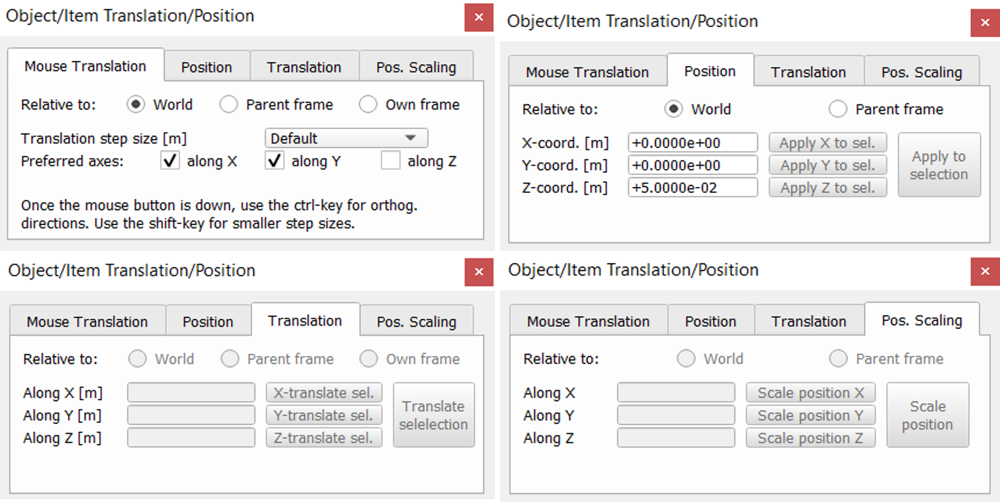

  

# ========================================
# Script: gerar_readme.py
# Objetivo: Gerar automaticamente o arquivo README.md
# Conteúdo baseado na Aula 3: Translação e Rotação no CoppeliaSim
# ========================================

readme = """
# 🤖 Aula 3 – Operações de Translação e Rotação no CoppeliaSim

Este repositório apresenta o conteúdo da Aula 3 da disciplina **Robótica Industrial**, ministrada pelo **Prof. MSc. Adilson Cunha Rusteiko**.  
O tema central da aula é a aplicação prática de **translação**, **rotação**, **sistemas de referência** e **hierarquia** no ambiente do **CoppeliaSim**.

---

## 🎯 Objetivos da Aula

- Compreender as operações de **translação** e **rotação** aplicadas a objetos.  
- Entender os diferentes **sistemas de referência (SR)** usados no CoppeliaSim.  
- Aplicar operações de translação e rotação **considerando hierarquia entre objetos**.  

---

## 🧭 Fundamentos: Translação e Rotação

### 📌 Posição e Orientação
- **Posição:** coordenadas Cartesianas (m).  
- **Orientação:** ângulos de Euler no formato **XYZ**.  

### 📌 Formas de executar operações
- Via **mouse** diretamente no simulador.  
- Usando o **Sistema de Referência do Objeto (SR)**.  
- Usando o **SR pai** ou qualquer outro SR relativo.  

---

## 🗂️ Sistemas de Referência no CoppeliaSim

- **Sistema de Referência Global (SR World)**  
- **Sistema de Referência do Objeto (SR Local)**  

Cada SR influencia a forma como translações e rotações são aplicadas.  
Modificar um objeto em um SR diferente muda completamente o resultado.

---

## 🏗️ Translação e Rotação com Hierarquia

- Objetos **pais** afetam automaticamente seus **filhos**.  
- Movimentações aplicadas ao objeto pai são propagadas para toda a cadeia.  
- A aula demonstra a diferença entre:
  - Operações **sem hierarquia**  
  - Operações **com hierarquia ativa**  

Exemplos práticos abordados:

- **Aula_03_00** — Movimentação sem hierarquia  
- **Aula_03_01** — Movimentação com hierarquia  

---

## 🔧 Opções de Movimentação no CoppeliaSim

### ✳️ Movimentação Cartesiana
- Alteração de posição nos eixos **X, Y e Z**.  

### ✳️ Movimentação Angular
- Rotação pelos eixos **RX, RY, RZ** (ângulos de Euler XYZ).

---

## 🔄 Utilizando Referências Entre Objetos

O CoppeliaSim permite usar a posição de um objeto para modificar outro.

### 📍 Exemplo:
Copiar a coordenada **X** do objeto B para o objeto A.

### 📝 Procedimento:
1. Selecione o **objeto A**.  
2. Pressione **SHIFT**.  
3. Selecione o **objeto B** (referência).  
4. Abra o painel **"Posição de Objetos"**.  
5. Clique no botão da coordenada **X** para copiar.  

Muito útil para alinhamentos e montagem de cenas complexas.

---

## 📄 Direitos Autorais

Material original produzido pelo professor:  
**Prof. MSc. Adilson Cunha Rusteiko** 

**WE ARE TOGETHER!**

"""
