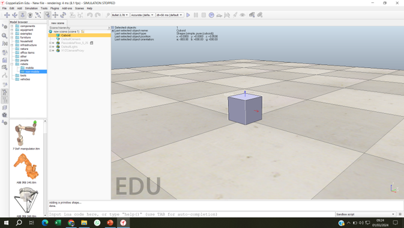

<p align="center">
  
</p>


# 🎥 AULA 7  
## Programação no CoppeliaSim – Controle de Velocidade  
### Cinemática e Robótica Industrial

---

## 🎬 **ABERTURA**

Depois de compreender articulações e sensores, chega o momento de dar vida à simulação.  
É através da programação que o robô passa a reagir, decidir e se mover de forma controlada.

Nesta aula, o foco está na **Programação no CoppeliaSim**, utilizando a **linguagem Lua** para o **controle de velocidade de articulações**.

---

## 🧠 **OBJETIVOS DA AULA**

Ao final desta aula, o estudante será capaz de:

- compreender a estrutura básica de programação no CoppeliaSim;  
- conhecer a linguagem **Lua** aplicada à simulação;  
- inserir e configurar scripts em objetos da cena;  
- utilizar o **Help do CoppeliaSim** como ferramenta de apoio;  
- implementar um exemplo prático de **controle de velocidade**.

---

## 💻 **AS LINGUAGENS DO COPPELIASIM**

O CoppeliaSim suporta múltiplas linguagens de programação:

```
Lua
C
Python
```

Entretanto, na **versão educacional**, apenas a **linguagem Lua** está habilitada.  
Por isso, ela será a linguagem oficial utilizada nesta disciplina.

---

## 📜 **O CONCEITO DE SCRIPT**

No CoppeliaSim, **scripts podem ser associados a qualquer objeto da cena**.  
Esses scripts são executados automaticamente quando a simulação é iniciada.

Cada objeto pode possuir sua própria lógica de comportamento.

---

## 🧩 **INSERINDO UM SCRIPT**

Para inserir um script em um objeto:

```
1. Selecione o objeto desejado
2. Acesse: Tools → Scripts
3. Abra a janela de scripts
```

⚠️ **Observação:**  
O objeto precisa estar selecionado para que o script seja corretamente associado.

---

## 🗂️ **TIPOS DE SCRIPT**

Ao criar um novo script, o CoppeliaSim oferece diferentes tipos:

```
Main Script
Child Script (non-threaded)
Child Script (threaded)
Customization Script
```

Nesta disciplina, será utilizado **sempre** o:

```
Child Script (non-threaded)
```

Esse tipo de script não bloqueia a simulação e é ideal para controle de atuadores e sensores.

---

## 🔗 **VINCULANDO O SCRIPT AO OBJETO**

Após criar o script:

- ele é automaticamente associado ao objeto;  
- um ícone de script aparece ao lado do objeto na árvore da cena;  
- ao dar duplo clique nesse ícone, o editor de código é aberto.

---

## 🔄 **ESTRUTURA DO SCRIPT**

Um script do tipo *Child Script (non-threaded)* apresenta quatro funções principais:

```
Inicialização da simulação
Atuação de atuadores
Leitura de sensores
Finalização da simulação
```

Essas funções organizam a lógica do comportamento do robô ao longo do tempo.

---

## 📚 **UTILIZANDO O HELP DO COPPELIASIM**

O Help do CoppeliaSim é uma das ferramentas mais importantes para o programador.

Nele é possível encontrar:

- funções para reconhecimento de objetos;  
- controle de velocidade;  
- controle de posição;  
- leitura de sensores;  
- e muito mais.

Cada função possui exemplos em **Lua** e **C**.

---

## 🔍 **EXEMPLO DE FUNÇÃO**

Um exemplo fundamental é a função:

```
sim.getObjectHandle
```

Ela permite obter o identificador de um objeto a partir do seu nome na cena — passo essencial para qualquer controle via script.

---

## ⚙️ **EXEMPLO PRÁTICO DE SIMULAÇÃO**

O exemplo da aula consiste em:

```
1. Inserir um cubo
2. Inserir um objeto cilíndrico
3. Inserir uma articulação
4. Inserir um script non-threaded
```

Configurações necessárias:

- cubo e cilindro como objetos **dinâmicos e responsivos**;  
- articulação configurada em **modo par/força**, com motor habilitado;  
- velocidade inicial configurada como zero.

---

## 🧱 **HIERARQUIA DOS OBJETOS**

A hierarquia correta é essencial:

```
Cubo (objeto pai)
└── Articulação
    └── Cilindro (objeto filho)
```

Essa relação define como o movimento será propagado na simulação.

---

## 🚀 **CONTROLE DE VELOCIDADE**

Para controlar a velocidade da articulação, utiliza-se a função:

```
sim.setJointTargetVelocity
```

Ao alterar os parâmetros dessa função, é possível:

- aumentar ou diminuir a velocidade;  
- inverter o sentido de rotação;  
- testar diferentes comportamentos dinâmicos.

---

## 🏁 **ENCERRAMENTO**

A programação é o elo entre a teoria e o movimento.  
É através dela que articulações obedecem comandos, sensores influenciam decisões e robôs passam a interagir com o ambiente.

Esta aula marca o início do **controle ativo de sistemas robóticos no CoppeliaSim**.
 
---

## 👤 **CRÉDITOS**

**Autor e Orientador:**  
Prof. MSc. Adilson Cunha Rusteiko  
Cinemática e Robótica Industrial


